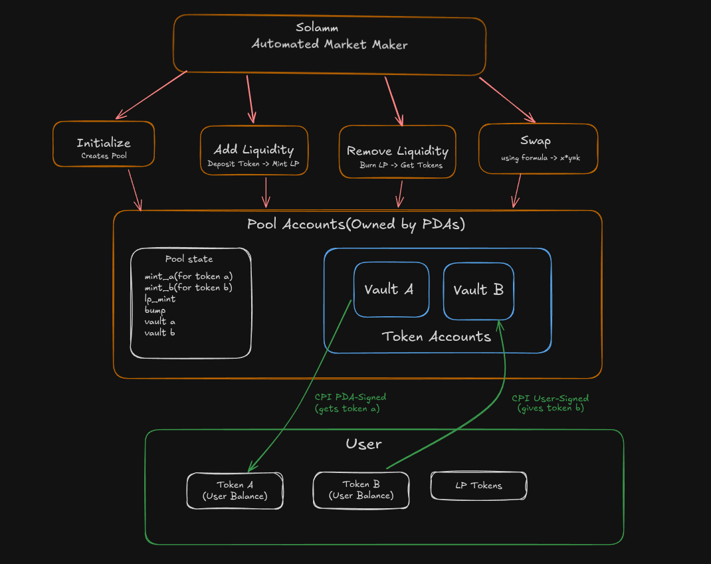
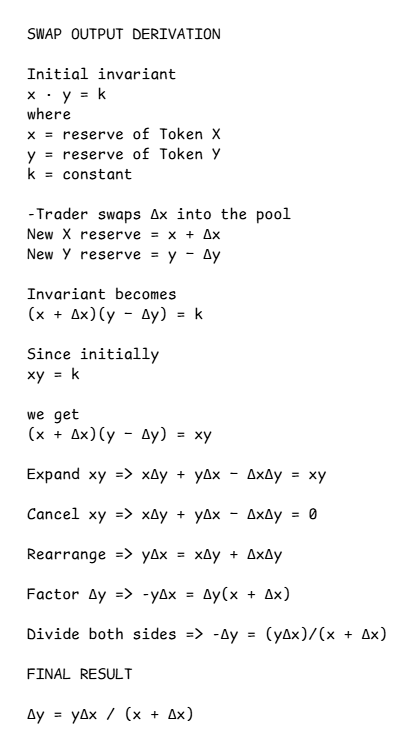

# solamm

A constant-product Automated Market Maker (AMM) built on Solana using the Anchor framework. Inspired by Uniswap v2, solamm allows anyone to create liquidity pools for SPL token pairs, provide liquidity and earn swap fees, swap tokens against the x*y=k invariant, and remove liquidity to redeem their proportional share.

Built with Rust, Anchor 1.0.2, and anchor-spl 1.1.1.


---

## Architecture

The program uses five PDA-owned accounts per pool:

| Account | Seeds | Purpose |
| :--- | :--- | :--- |
| `Pool` | `["pool", mint_a, mint_b]` | Stores pool state — mints, vaults, fee, bumps |
| `Vault A` | `["vault_a", pool]` | Holds token A reserves |
| `Vault B` | `["vault_b", pool]` | Holds token B reserves |
| `LP Mint` | `["lp_mint", pool]` | Mints and burns LP share tokens |
| `Authority` | `["authority", pool]` | PDA that signs all CPIs |

`mint_a < mint_b` enforced by pubkey ordering — one canonical pool per pair.

---

## Instructions

### `init_pool`
Creates a new liquidity pool for a token pair.

| Argument | Type | Description |
| :--- | :--- | :--- |
| `fee_bps` | `u64` | Swap fee in basis points (30 = 0.3%) |

### `add_liquidity`
Deposit token A and token B into the pool. Receive LP tokens proportional to your share.

| Argument | Type | Description |
| :--- | :--- | :--- |
| `amount_a` | `u64` | Amount of token A to deposit |
| `amount_b` | `u64` | Amount of token B to deposit |
| `min_lp_out` | `u64` | Minimum LP tokens to receive (slippage protection) |

### `swap`
Swap one token for the other against the $x \cdot y = k$ invariant.

| Argument | Type | Description |
| :--- | :--- | :--- |
| `amount_in` | `u64` | Amount of input token to swap |
| `min_amount_out` | `u64` | Minimum output tokens to receive (slippage protection) |
| `a_to_b` | `bool` | `true` = swap A→B, `false` = swap B→A |

### `remove_liquidity`
Burn LP tokens and receive proportional share of both token reserves.

| Argument | Type | Description |
| :--- | :--- | :--- |
| `lp_amount` | `u64` | Amount of LP tokens to burn |
| `min_a_out` | `u64` | Minimum token A to receive (slippage protection) |
| `min_b_out` | `u64` | Minimum token B to receive (slippage protection) |

---

## Math

### Swap Formula
Output is always floored — favors the pool. The fee stays in `vault_in`, so `reserve_in` grows by more than `amount_in_with_fee / 10_000`.


---

### LP Token Minting
*   **First deposit:** Geometric mean prevents the share-inflation attack.
*   **Subsequent deposits:** $\min(\text{amount}_a \cdot \frac{\text{supply}}{\text{reserve}_a}, \text{amount}_b \cdot \frac{\text{supply}}{\text{reserve}_b})$.

### Rounding Rule
*   **Outputs:** Always **FLOOR** — user gets less, pool keeps remainder.
*   **Inputs:** Always **CEIL** — user pays more, pool gains.

---

## Security

| Attack | Defense | Where |
| :--- | :--- | :--- |
| Reinitialization | Anchor `init` discriminator | `init_pool` |
| Fake vault | `has_one = vault_a`, `has_one = vault_b` | all contexts |
| Fake authority | `has_one = authority` + seeds constraint | all contexts |
| Fake LP mint | `has_one = lp_mint` | add/remove |
| Integer overflow | all math in `u128`, `checked_mul` | `math.rs` |
| Rounding leak | always floor outputs | `math.rs` |
| First-deposit inflation | `sqrt(a * b)` initial LP | `add_liquidity` |
| Sandwich / slippage | `min_amount_out` enforced | `swap` |
| PDA collision | `mint_a < mint_b` enforced | `init_pool` |
| Zero liquidity swap | `require!(reserve > 0)` | `math.rs` |

---

## Setup

### Prerequisites
* Rust, Anchor CLI 1.0.2, Solana CLI, Node.js

### Build
```bash
anchor build
```

---

## Deployment

The program is deployed on **Solana devnet** via [Helius](https://helius.dev) RPC.

- **Program ID:** `GCuuqz4THCtS76xqQrqkvrVPsYwiWsfVvWBk6ABCJKvB`
- **RPC:** `https://devnet.helius-rpc.com`
- **Explorer:** [View on Solana Explorer](https://explorer.solana.com/address/GCuuqz4THCtS76xqQrqkvrVPsYwiWsfVvWBk6ABCJKvB?cluster=devnet)

### Deploy command

```bash
anchor build
anchor deploy --provider.cluster devnet
```

---

## Running the Devnet Test

The script [`scripts/devnet_test.ts`](./scripts/devnet_test.ts) runs a full end-to-end test against the live devnet program:

1. Creates two SPL token mints
2. Calls `init_pool` (fee = 30 bps)
3. Calls `add_liquidity`
4. Calls `swap` (A → B)
5. Calls `remove_liquidity` (half LP)

### Prerequisites

- Solana wallet at `~/.config/solana/id.json` with at least **0.5 SOL** on devnet
- Node.js dependencies installed

```bash
yarn install
```

If you need devnet SOL:

```bash
solana airdrop 2
```

### Run

```bash
yarn test:devnet
```


